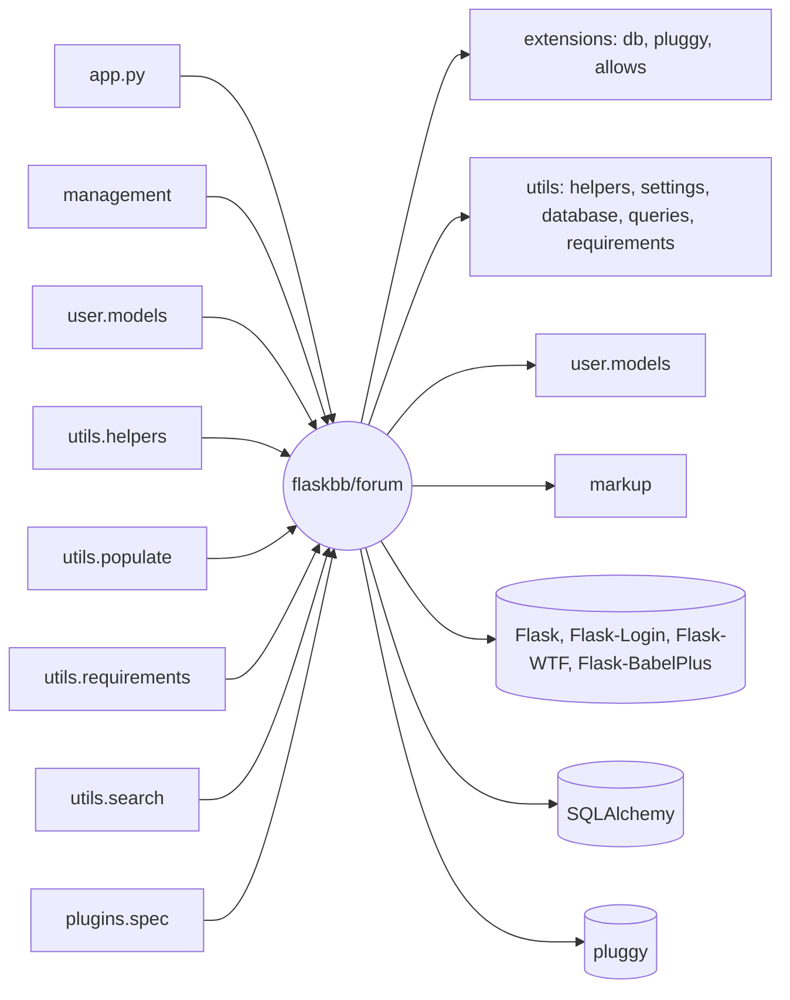

# Análise do sistema legado

Módulo analisado: `flaskbb/forum/`.

## Dependências

Quem o forum importa: dentro do flaskbb ele usa o `extensions` (`db`, `pluggy`, `allows`), vários arquivos do `utils` (`helpers`, `settings`, `database`, `queries`, `requirements`), o `user.models` e o `markup`. De bibliotecas de fora, usa principalmente Flask, SQLAlchemy, Flask-Login, Flask-WTF/WTForms, Flask-BabelPlus, flask_allows2 e pluggy.

Quem importa o forum: o `app.py` (registra as views e os filtros do Jinja), o `management` (views e forms do admin), o `user.models`, e no `utils` o `helpers`, `populate`, `requirements` e `search`. O `plugins/spec.py` também usa os modelos nas assinaturas dos hooks.

Achei isso com `grep` procurando `flaskbb.forum` e os imports dos arquivos da pasta.

## Acoplamento e coesão

1. Alto acoplamento entre `forum` e `user` (import circular). O `forum.models` precisa do `User` e o `user.models` precisa dos modelos do forum. Pra não dar erro de import circular, o código faz import dentro das funções, por exemplo em `Topic.involved_users` e `Topic._fix_user_post_counts`. No próprio código tem o comentário `# todo: Find circular import and break it` (`models.py:1057`). Qualquer mudança num dos dois módulos pode quebrar o outro.
2. Alto acoplamento com o SQLAlchemy e o `db.session`. Os modelos acessam o banco direto: são 61 usos de `db.session` só no `models.py`, e os métodos de regra de negócio fazem `commit` no meio (`Post.save`, `Topic.move`, `Topic.hide` etc.). Não dá pra testar a regra de "atualizar o último post do fórum" sem banco, e trocar a forma de guardar os dados exigiria mexer em quase todo método.
3. Baixa coesão no `models.py`, principalmente na classe `Topic`. O arquivo tem mais de 1600 linhas e a `Topic` sozinha junta coisas bem diferentes: montar URL e slug, salvar, apagar, esconder, mover de fórum, recalcular contadores, controlar o que o usuário leu (`tracker_needs_update`, `update_read`, `first_unread`) e buscar posts paginados. Na Parte 2 também achei o `Post._deal_with_last_post`, que é do `Post` mas só mexe em dados do `Topic` e do `Forum` (Feature Envy).

## Pontos de fragilidade

1. O tracker de leitura está espalhado em dois arquivos. A regra de "o que está lido" fica no `forum/models.py` (`Topic.tracker_needs_update`, `Topic.update_read`, `Forum.update_read`) e também no `utils/helpers.py` (`topic_is_unread` e `forum_is_unread`). A data de corte (`TRACKER_LENGTH`) é calculada em três lugares diferentes, e nem do mesmo jeito: no helpers ele calcula a data antes de ver se o tracker está desligado. Mudar a regra num lugar e esquecer do outro faz a tela mostrar "não lido" diferente do que o banco guarda.
2. Contadores e "último post" atualizados à mão. `post_count`, `topic_count` e os 5 campos `last_post_*` do fórum são atualizados manualmente no `save`, `delete`, `hide`, `unhide` e `move` do `Post` e do `Topic`. Se alguém criar um caminho novo (por exemplo mover vários posts) e esquecer de atualizar um desses campos, o fórum mostra número errado. Foi aqui que achei o Data Clumps da Parte 2.
3. As views quase não têm teste. O `views.py` tem 6% de cobertura e o `forms.py` 0% (medido na Parte 1). É por ali que o usuário cria tópico, responde e modera, ou seja, é o caminho mais usado, e uma mudança nele só seria percebida rodando o sistema na mão.

## Lei de Lehman

As leis que mais aparecem são a da Mudança Contínua e a do Crescimento Contínuo, e junto a da Complexidade Crescente. O primeiro commit na pasta `forum/` é de 2013-09-11 e desde então foram 317 commits nela, 168 só no `models.py`. O `models.py` tinha 972 linhas no fim de 2014, 1329 em 2018, 1428 em 2024 e 1665 no commit base do projeto. Em 2026 ainda teve uma leva grande de commits só pra adaptar o código ao SQLAlchemy 2 (`mapped_column`, novas queries) e trocar pro Flask-Allows2, ou seja, o sistema teve que mudar pra continuar funcionando com as bibliotecas atuais, mesmo sem funcionalidade nova. A complexidade crescente aparece nos smells que achei na Parte 2 (método longo, código duplicado, `else` morto) e nos comentários que ficaram pra trás, como `# we sure this should be nullable?` (`models.py:235`) e os `TODO` nas linhas 175 e 508, que ninguém voltou pra resolver.

Esses números tirei com `git log -- flaskbb/forum` e `git show <commit>:flaskbb/forum/models.py | wc -l`.

## Seams

1. Tracker de leitura. Hoje os chamadores (a view do tópico em `views.py:227`, os filtros do Jinja no `app.py` e o `Topic.first_unread`) chamam direto as funções do models e do helpers. Se eles passassem a chamar um objeto "tracker" com uma interface (ex.: `is_topic_unread`, `mark_topic_read`), daria pra trocar a implementação em teste por uma falsa e em produção por uma versão nova, sem mudar quem chama. É esse seam que uso na proposta de evolução.
2. Relógio (`time_utcnow`). O models chama `time_utcnow()` direto em vários lugares (datas de criação, `last_read`, data de corte do tracker). Na Parte 1 eu só consegui testar o `tracker_needs_update` trocando essa função com `mocker.patch`. Se o relógio fosse recebido como dependência (ou ficasse num objeto de configuração), dava pra controlar o tempo nos testes sem patch e testar as bordas de data com mais facilidade.
