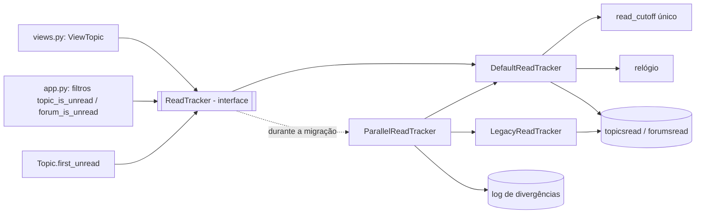

# Proposta de evolução

Proposta escolhida: aposentar aos poucos o código atual do **tracker de leitura** (o que controla se um tópico ou fórum está "não lido") usando **Branch by Abstraction** com **execução paralela**.

## Motivação

Na análise (`ANALISE_LEGADO.md`), o ponto de fragilidade número 1 foi o tracker de leitura estar espalhado em dois arquivos: parte no `forum/models.py` (`Topic.tracker_needs_update`, `Topic.update_read`, `Forum.update_read`, `Forum._count_unread_topics`) e parte no `utils/helpers.py` (`topic_is_unread` e `forum_is_unread`). A data de corte do `TRACKER_LENGTH` é calculada em três lugares e nem do mesmo jeito. Foi também nessa parte do código que achei boa parte dos smells da Parte 2: o Long Method do `Forum.update_read`, o cálculo duplicado do `read_cutoff` e o `else` morto do `Topic.update_read`. Eu tirei a duplicação dentro do `models.py`, mas o helpers continua com a própria versão da regra.

O problema é que quem chama o tracker (a view do tópico, os filtros do Jinja no `app.py` e o `Topic.first_unread`, conforme o `MODULO.md`) chama direto essas funções. Então qualquer mudança na regra tem que ser feita em vários lugares ao mesmo tempo, e se der errado o usuário vê tópicos marcados como não lidos de forma errada. A ideia é colocar uma abstração na frente do tracker (o seam 1 da análise), fazer uma implementação nova com a regra num lugar só, rodar as duas juntas comparando os resultados e só depois trocar e apagar a antiga, sem precisar parar o fórum nem mudar tudo de uma vez.

## Estado-alvo

### Novos artefatos

- `flaskbb/forum/tracker/base.py`: a interface `ReadTracker` (um `Protocol`) com os métodos `is_topic_unread`, `is_forum_unread`, `mark_topic_read` e `read_cutoff`.
- `flaskbb/forum/tracker/legacy.py`: `LegacyReadTracker`, que só chama as funções que existem hoje (`topic_is_unread`, `forum_is_unread`, `Topic.update_read`).
- `flaskbb/forum/tracker/default.py`: `DefaultReadTracker`, a implementação nova, com a data de corte calculada num lugar só e recebendo o relógio como dependência.
- `flaskbb/forum/tracker/parallel.py`: `ParallelReadTracker`, que chama as duas implementações, devolve o resultado da antiga e registra no log quando a nova dá diferente.
- Uma configuração nova, `READ_TRACKER` (`legacy`, `parallel` ou `default`), pra escolher qual implementação usar.
- `tests/unit/forum/test_read_tracker_contract.py`: testes de contrato que rodam os mesmos casos nas implementações.

## Plano de migração incremental

1. **Escrever testes de caracterização do tracker.** Criar testes pro comportamento atual de `topic_is_unread`, `forum_is_unread`, `tracker_needs_update` e dos dois `update_read`, incluindo as bordas (`TRACKER_LENGTH` = 0, tópico mais velho que a data de corte, fórum marcado como lido). O código de produção não muda nada. Verificação: a suíte passa e a cobertura dessas funções sobe; o relógio é controlado com mock, igual fiz na Parte 1.
2. **Criar a interface `ReadTracker` e o `LegacyReadTracker`.** O legacy só repassa as chamadas pro código atual. Ninguém usa a interface ainda, então o sistema continua funcionando igual. Verificação: os testes de contrato rodam no `LegacyReadTracker` e dão o mesmo resultado dos testes de caracterização.
3. **Trocar os chamadores pra usar a interface, um de cada vez.** Primeiro os filtros do Jinja no `app.py`, depois a view do tópico (`views.py:227`) e depois o `Topic.first_unread`, cada um num commit. A implementação configurada continua sendo a legacy, então o resultado pro usuário é o mesmo. Verificação: suíte completa depois de cada troca e um teste de view com o `client` do Flask abrindo um tópico e conferindo a marcação de não lido.
4. **Criar o `DefaultReadTracker` e rodar em paralelo.** Implementar a regra nova, com uma data de corte só e o relógio injetado. Ligar `READ_TRACKER = parallel` num ambiente de teste: o `ParallelReadTracker` devolve sempre o resultado do legacy (então o usuário não vê diferença) e loga toda vez que o novo discorda. Verificação: os testes de contrato passam nas duas implementações e o log de divergências fica vazio depois de um tempo de uso.
5. **Virar a chave pro novo.** Trocar o padrão pra `READ_TRACKER = default`. O legacy continua no código por uma versão, e se aparecer problema é só voltar a configuração pra `legacy`, sem precisar de deploy de código. Verificação: suíte completa, testes de contrato e acompanhar se aparecem reclamações ou erros no log.
6. **Remover o código antigo.** Apagar o `LegacyReadTracker`, o `ParallelReadTracker`, a lógica duplicada do `utils/helpers.py` e os métodos do tracker que sobraram no `Topic` e no `Forum`. As funções `topic_is_unread` e `forum_is_unread` podem ficar como uma chamada simples pro tracker novo, pra não quebrar plugins. Verificação: suíte completa e um `grep` confirmando que ninguém mais chama o código antigo.

## Riscos e mitigação

| Risco | Mitigação |
|---|---|
| A implementação nova dar resultado diferente em alguma borda (ex.: `TRACKER_LENGTH` = 0, fuso horário, fórum marcado como lido). | Testes de caracterização no passo 1 e execução paralela no passo 4, que mostra as diferenças no log antes de qualquer usuário ser afetado. |
| A execução paralela dobrar as consultas no banco e deixar as páginas mais lentas. | Usar o modo `parallel` só em ambiente de teste ou numa parte das requisições, e desligar assim que o log ficar sem divergências. |
| Plugins ou templates de terceiros chamarem `topic_is_unread` e `forum_is_unread` direto e quebrarem quando o código antigo for removido. | Manter essas duas funções com o mesmo nome e assinatura, só repassando pro tracker novo, e avisar no changelog antes de remover de vez. |

## Fora do escopo

- Não muda as tabelas `topicsread` e `forumsread`, então não tem migração de banco.
- Não muda nada visual nas telas nem nos templates, só de onde vem a informação de "não lido".
- Não mexe no `topictracker` (a função de seguir tópico) nem nos contadores de posts e tópicos.
- Não troca o SQLAlchemy nem cria uma camada de repositórios pro módulo inteiro. Só o tracker ganha a abstração.
